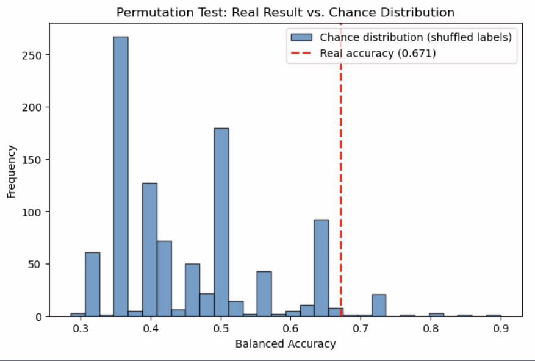

# EEG Pain Sensitivity Classifier

Predicting individual pain sensitivity from laser-evoked EEG responses, using [OpenNeuro ds005284](https://openneuro.org/datasets/ds005284) (26 subjects, laser-evoked pain potential study).

This README documents the full process — including the parts that didn't work. The original plan wasn't possible with the available data, several modeling approaches failed before one succeeded, and two subjects turned out to be data artifacts rather than real biology. That process is the point: this is an honest account of small-sample applied EEG analysis, not a cherry-picked result.

---

## 1. The Question

Laser-evoked potentials (LEPs) are EEG responses recorded immediately after a painful laser stimulus. Prior pain-neuroscience literature links certain LEP components — particularly the P2 component — to how a person subjectively experiences pain.

**Original hypothesis:** classify per-trial pain ratings (0–10 scale) from single-trial EEG features.

**Problem:** after inspecting the events files and `participants.tsv`, this dataset release does not include per-trial subjective pain ratings anywhere. The only relevant value is one number per subject: `Pain_Threshold_7` — the laser intensity calibrated during setup to produce a 7/10 pain rating for that individual. A lower threshold means a more pain-sensitive person.

**Revised hypothesis:** EEG features from the laser-evoked response can distinguish **high pain-sensitivity** subjects from **low pain-sensitivity** subjects, using a median split on `Pain_Threshold_7`. This became a binary classification problem rather than a regression problem — a more defensible choice given the small sample size (n=26).

---

## 2. Method

**Features:** 7 pre-extracted EEG features per subject — N2 and P2 latency and amplitude, N-P peak-to-peak amplitude, peak alpha frequency, and alpha power. (These features come from a separate signal-extraction pipeline — see [EEG-Pain-Analysis](https://github.com/Sai-sasi/EEG-Pain-Analysis) for that raw processing step.)

**Label:** binary pain sensitivity group (median split on `Pain_Threshold_7`), 16 subjects high-sensitivity, 10 low-sensitivity.

**Validation: Leave-One-Out Cross-Validation (LOOCV).** With only 26 subjects, a standard train/test split (e.g. 80/20) would leave a test set of ~5 subjects — far too small and high-variance to trust. LOOCV instead trains on 25 subjects and tests on the 1 left out, repeating this for every subject, giving a far more stable estimate of real-world performance at this sample size. This is standard practice in small-n neuroscience research.

**Models:** Linear Discriminant Analysis (LDA) and a linear-kernel Support Vector Machine (SVM), each inside a pipeline with `StandardScaler` to normalize feature scales before fitting.

---

## 3. What Didn't Work (and why that's useful)

**Baseline model, all 7 features:** both LDA (0.494 balanced accuracy) and SVM (0.450) performed at essentially chance level. Rather than concluding "no relationship exists," this was treated as a prompt to check data quality before trusting the model.

**Outlier check:** a boxplot of `alpha_power_uv2` revealed two subjects (sub-010, sub-014) with values roughly 3+ standard deviations above the rest of the cohort — a difference far more consistent with a data artifact (noisy channel, muscle artifact, poor electrode contact) than genuine biological variation. Removing them improved LDA modestly (0.571) but left SVM unchanged (0.486) — cleaning helped, but wasn't the whole story.

**Feature-level correlation check:** testing each of the 7 features individually against the label (point-biserial correlation, on the cleaned 24-subject data) showed that only one feature — `p2_latency_ms` — was individually significant (r = -0.445, p = 0.030). The rest ranged from weak to negligible, suggesting they were adding noise rather than signal when included together.

---

## 4. What Worked

Using `p2_latency_ms` alone, LDA reached **0.671 balanced accuracy** — clearly outperforming every multi-feature combination tested. Less was more: one biologically-motivated feature beat the full feature set.

| Model | Features | Balanced Accuracy |
|---|---|---|
| LDA | all 7 | 0.494 |
| SVM | all 7 | 0.450 |
| LDA | 7, outliers removed | 0.571 |
| SVM | 7, outliers removed | 0.486 |
| LDA | 3 selected | 0.521 |
| SVM | 3 selected | 0.586 |
| **LDA** | **`p2_latency_ms` only** | **0.671** |

**Interpretation:** shorter (faster) P2 latency was associated with higher pain sensitivity — consistent with existing pain-neuroscience literature on laser-evoked potentials.

---

## 5. Is 0.671 Real, or Luck?

Testing 7 individual features plus several combinations and reporting the best result creates a real risk of a false positive by chance (the multiple-comparisons problem). To check this honestly, a permutation test was run: the pain-sensitivity labels were randomly shuffled 1000 times, breaking any true relationship between EEG and pain sensitivity, and the same LOOCV pipeline was rerun on each shuffle to build a null (chance) distribution.

**Result:**
- Real accuracy: **0.671**
- Mean chance accuracy: **0.455** (consistent with the ~0.50 expected from pure guessing)
- **P-value: 0.032**

Only 3.2% of 1000 random shuffles matched or exceeded the real result. This is below the conventional 0.05 significance threshold — evidence that the `p2_latency_ms` result reflects a genuine relationship in this dataset, not a lucky pick among the combinations tested.

---

## 6. Honest Limitations

- **Small sample size** (n=24 after exclusions). This should be read as a pilot-scale finding, not a validated biomarker.
- **Modest effect size** — 0.671 balanced accuracy is a real signal, not a high-confidence classifier.
- Two subjects were excluded based on an extreme outlier in one feature. The underlying cause (likely a recording artifact) wasn't traced back to the raw EEG signal in this analysis — a natural next step.
- The feature selection process (testing several combinations, reporting the strongest) is precisely why the permutation test was necessary here, and it's reported rather than omitted.

---

## 7. Project Structure
├── EEG_Pain_Sensitivity_Classifier.ipynb # full analysis notebook
├── group_results.csv # pre-extracted EEG features per subject
├── permutation_test_plot.png # permutation test visualization
└── README.md

**Data:** raw EEG data is not included in this repository (too large, and not mine to redistribute). Download it directly from [OpenNeuro ds005284](https://openneuro.org/datasets/ds005284) using `openneuro-py`, and place it in a local `data/` folder to reproduce this analysis.

---

## Related Repositories

- [EEG-Pain-Analysis](https://github.com/Sai-sasi/EEG-Pain-Analysis) — the upstream signal-extraction pipeline (raw EEG processing, N2/P2/alpha biomarker extraction) that produces `group_results.csv`, the input to this project
- [Electrophysiological-recordings](https://github.com/Sai-sasi/Electrophysiological-recordings) — BBSRC-funded MSc dissertation, spinal pain circuit electrophysiology (patch-clamp, p=0.033)

---

## Licence

Code in this repository is released under the MIT Licence. The underlying dataset is licensed CC0 1.0 Universal by its original authors — see [OpenNeuro](https://openneuro.org/datasets/ds005284) for terms.

---

## Author

Sai Sasi Sekhar Kongala — MSc Brain Sciences, University of Glasgow. Background in electrophysiology and computational neuroscience.

📧 sasisasisekhark@gmail.com · [github.com/Sai-sasi](https://github.com/Sai-sasi) · Glasgow, UK
